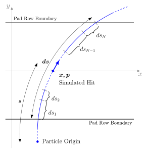

[](https://travis-ci.org/bnlnpps/tpc-rs)

**tpc-rs** is a C++ library to simulate and digitize the signal produced by
charged particles traversing the sensitive volume of a Time Projection Chamber
(TPC).


## Quick Start

Building the library from source is fairly straightforward. The only external
dependency is [ROOT](https://github.com/root-project/root) which is assumed to
be available on the system.

    git clone https://github.com/bnlnpps/tpc-rs.git
    cd tpc-rs && mkdir build && cd build
    cmake ../
    cmake --build . -- install


## Installation

Additional arguments to the `cmake` command can be provided to customize the
installation if the default ones do not meet your project/system requirements.
Here is a few commonly used CMake options:

    -DCMAKE_INSTALL_PREFIX=<path>

`<path>` can be absolute or relative. One can specify it to distinguish between
different build types and/or versions, e.g.
`/opt/local/tpc-rs-ABC-Debug-i686` or `${HOME}/tpc-rs-XYZ-Release-x86_64`.

    -DCMAKE_BUILD_TYPE=<build_type>

with `<build_type>` being one of `Debug`, `RelWithDebInfo`, or `Release`.

     -DBUILD_TESTING=OFF

skips building of the tests.


## How to Use

To use an installed tpc-rs library in another CMake project just include the
following in your CMakeLists.txt:

    find_package(tpcrs [major.minor] [EXACT] [REQUIRED])
    target_link_libraries(<your_target> PUBLIC tpcrs)


## Basic Test

Once the source code is built one can execute basic tests to verify the
integrity and performance of the library. For that purpose, a reference file is
provided with a pre-generated input and the corresponding output from the main
`tpc-rs` conversion routine.

    cd tpc-rs/build
    ctest -R quick
    ctest -R long


## How It Works

The TPC detector geometry is assumed to have a cylindrical shape constructed out
of trapezoidal sectors oriented along the main axis. The entire volume is split
in the middle into two halves by a central membrane. Each sector has sensitive
readout elements, pads, assembled in rows on the outside planes of the sectors.
A set of sector, row, and pad numbers compose a hardware address which in
combination with the timing information can be used to measure spatial
coordinates of interactions occurring within the TPC volume.

```c++
struct DigiChannel
{
  unsigned int sector : 5, row : 7, pad : 10, timebin : 10;
}
```

The output of the TPC response simulator needs to resemble the data coming from
real measurements. In the simplest case the output is just a collection of ADC
values associated with corresponding digitization channels. In case of
zero-suppressed channels, the ADC values can be indexed by `DigiChannel` as
shown below for `DigiHit`:

```c++
struct DigiHit
{
  DigiChannel channel;
  int adc;
}
```

The main response simulator routine expects a list of simulated hits with the
following data members:

```c++
struct SimulatedHit
{
  int track_id;    /// Unique id of the particle/track produced this hit
  int particle_id; /// Physical particle id, e.g. GEANT particle id
  int volume_id;   /// Volume id packed as a four digit decimal number SSRR, SS = sector, RR = pad row
  double x[3];     /// Position of the simulated hit, i.e. where the particle crosses the center of a pad row layer
  double p[3];     /// Local particle momentum at point x
  double de;       /// Energy deposited by the particle within pad row boundaries
  double ds;       /// Path length within pad row boundaries
  double s;        /// Distance along the track from the origin to the point x. Used in hit ordering
  double tof;      /// Time of flight up to the point x including the track origin production time
  float lgam;      /// log_10(E_kin/mass) -- deprecated
}
```

Currently, the simulated hits must be sorted by sector, track id, and the
distance to the track origin in order to insure that the simulated hits are
grouped according to their parent tracks.

For all generated particles path segments are built around the simulated hits
after applying all distortion and misalignment effects. The boundaries of pad
row layers define the start and end points of each segment.

The path of a particle within the pad row layer is simulated by stepping along
the helix specified by the position and the momentum at the distorted hit. The
total number of steps, N, and their sizes, ds_i, are defined by a stochastic
model describing the production of primary electrons with the particle
parameters adjusted accordingly at every step.



Based on the energy of each primary electron secondary electrons are generated
in turn according to a stochastic distribution. The secondary electrons are then
transported to the readout plane taking into account the transverse and
longitudinal diffusions effects. The algorithm identifies the pads receiving the
charge spread among multiple rows and pads from each electron. The amount of
charge deposited in each pad is corrected based on empirical coupling
distributions in transverse and longitudinal directions. Finally, the charges
from all electrons are combined and assigned to individual digitization
channels.
